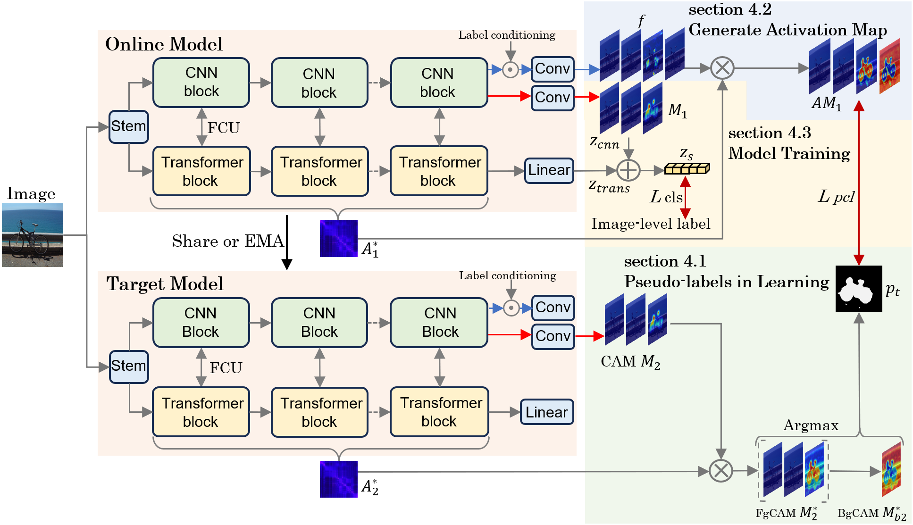

# BAO: Background-aware Activation Map Optimization for Weakly Supervised Semantic Segmentation without Background Threshold

## Abstract
Weakly supervised semantic segmentation (WSSS), which employs only image-level labels, has attracted significant attention due to its low annotation cost. In WSSS, pseudo-labels are derived from class activation maps (CAMs) generated by convolutional neural networks or vision transformers. However, during the generation of pseudo-labels from CAMs, a background threshold is typically used to define background regions. In WSSS scenarios, pixel-level labels are typically unavailable, which makes it challenging to determine an optimal background threshold. This study proposes a method for generating pseudo-labels without a background threshold. The proposed method generates CAMs that activate background regions from CAMs initially based on foreground objects. These background-activated CAMs are then used to generate pseudo-labels. The pseudo-labels are then used to train the model to distinguish between the foreground and background regions in the newly generated activation maps. During inference, the background activation map obtained via training replaces the background threshold. To validate the effectiveness of the proposed method, we conducted experiments using the PASCAL VOC 2012 and MS COCO 2014 datasets. The results demonstrate that the pseudo-labels generated using the proposed method significantly outperform those generated using conventional background thresholds.



## Prerequisite

#### 1. Install dependencies
```pip install -r requirements.txt```

#### 2. Download dataset
Download PASCAL VOC 2012 development kit from (http://host.robots.ox.ac.uk/pascal/VOC/voc2012/)

## Usage

### BAO step

#### 1. Training
Use TransCAM trained weights for learning(https://github.com/liruiwen/TransCAM)

```python train_bao.py --weights ../..```

our trained weights [here](https://drive.google.com/drive/u/0/folders/1QegDgV-AagnpJHBjlPQZvgnHQgmm120F)

#### 2. Infer
```python infer_bao.py --weights ../..```

#### 3. Evaluation
```python evaluation_bao.py --comment bnr --predict_dir ../..```

### Visualization

#### 1. CAM Visualization
```visual_bao.py```

### Learning semantic segmentation model

#### 1. Semantic segmentation
semantic segmentation models are trained according to MCTformer(https://github.com/xulianuwa/MCTformer)

## Acknowledge 
This implementation is based on [TransCAM[1]](https://github.com/liruiwen/TransCAM) and [AMN[2]](https://github.com/gaviotas/AMN). Thanks for the awesome work.

[1] Li, Ruiwen, et al. "Transcam: Transformer attention-based cam refinement for weakly supervised semantic segmentation." Journal of Visual Communication and Image Representation 92 (2023): 103800.

[2] Lee, Minhyun, Dongseob Kim, and Hyunjung Shim. "Threshold matters in wsss: Manipulating the activation for the robust and accurate segmentation model against thresholds." Proceedings of the IEEE/CVF conference on computer vision and pattern recognition. 2022.


